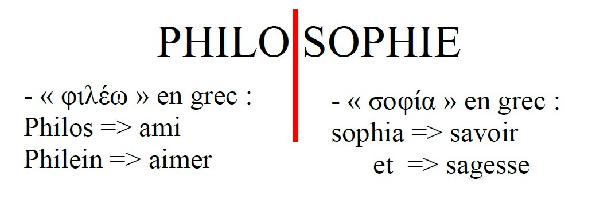
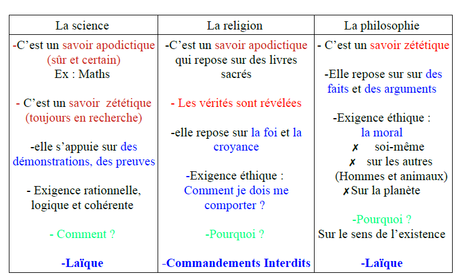
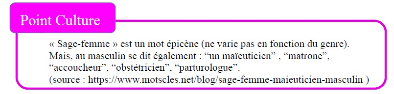

<meta chartes="utf-8" />
<html>
 <head></head>

 <body>
 <h1 id="para1">QU'EST-CE QUE LA PHILOSOPHIE?</h1>
  
  
 
L'étymologie grecque du mot "Philosophie":
  
 <iframe src="https://drive.google.com/file/d/14BgtKV6_uXQsB_hg8aT5UZT3TVkRV4-U/preview" width="500" height="150" allow="autoplay"></iframe>
 
 
 La philosophie est donc l'amour de la <b style="color:red;"> sagesse </b> et de<b style="color:red;"> savoir</b>. Le philosophe les désire, les recherche, parce qu'il ne les possède pas.  

  
 
Le Sage (≠philosophe) incarne ses idées, c'est un <i><mark> savoir pratique, en acte</mark></i>, ses idées servent un idéal du bien qui le dépasse en tant qu'individu.
   Le philosophe a plutôt un <i><mark> savoir théorique.</mark></i>

  
 
La philosophie est née en Grèce, à Athènes, au IVe siècle avant Jésus-Christ.
   L’apparition de la Première démocratie permet la création des débats sur le bien/ le
mal ; le juste/ l’injuste, sur les lois, ainsi naît la philosophie.

  
 
La naissance de la philosophie a lieu grâce à une émotion: l' <mark>étonnement face</mark>:

 <ul>
      <li id="para3">φ.  au monde qui entoure l’homme (beauté, catastrophes naturelles,…) </li>
      <li id="para3">φ.   à la <i id="para4"> mythologie, la science</i>  &nbsp;&nbsp; &nbsp;&nbsp; &nbsp;&nbsp; &nbsp;&nbsp; &nbsp;&nbsp; &nbsp;&nbsp;<b id="para5">QUE PUIS-JE CONNAÎTRE ?</b></li>
      <li id="para3">φ.à la mort =<i id="para4">la finitude</i></li>
      <li id="para3">φ.à la <i id="para4">religion</i>  &nbsp;&nbsp; &nbsp;&nbsp; &nbsp;&nbsp; &nbsp;&nbsp; &nbsp;&nbsp; &nbsp;&nbsp;<b id="para5">QUE PUIS-JE ESPÉRER ?</b></li>
      <li id="para3">φ.à la <i id="para4">morale</i>  &nbsp;&nbsp; &nbsp;&nbsp; &nbsp;&nbsp; &nbsp;&nbsp; &nbsp;&nbsp; &nbsp;&nbsp;<b id="para5">QUE DOIS-JE FAIRE ?</b></li>
 </ul>
 
<b>QU’EST-CE QUE L’HOMME ?</b>

  
 
<i><u>=> 4  questions fondamentales de la phlosophie, Emmanuel KANT, philosophe allemand du XVIIIe siècle (Les Lumières)</u></i> 

  
  
 
 La mort est nécessaire (c-à-d. ce qui ne peut pas ne pas être).
    &nbsp;&nbsp; &nbsp;&nbsp; &nbsp;&nbsp; &nbsp;&nbsp; &nbsp;&nbsp; &nbsp;&nbsp;≠ contingent.e (c-à-d. ce qui peut ne pas être)
      &nbsp;&nbsp;&nbsp; &nbsp;&nbsp; &nbsp;&nbsp; &nbsp;&nbsp; &nbsp;&nbsp; &nbsp;&nbsp; → La naissance est <b><u> contingente</u></b>.

  
 
 La mort est inconditionnelle.
   &nbsp;&nbsp;&nbsp; &nbsp;&nbsp; &nbsp;&nbsp; &nbsp;&nbsp; (c-à-d. qui arrive sans condition.s, n'importe où, n'importe quand)

     
  
 
 <iframe src="https://drive.google.com/file/d/11lIVmVaC4KPXCqkYhjwmVa3yTE9bS7GA/preview" width="640" height="480" allow="autoplay"></iframe>
   
  <table id="p2">
   <tr>
     <th>La Science</th>
     <th>La Religion</th>
     <th>La Philosophie</th>
   </tr>
   <tr>
     <td>
- c'est un <b style="color:#FF0000;"> savoir apodictique  (sûr et certain)</b>  Ex: Maths
- c'est un <b style="color:#FF0000;"> savoir zététique   (toujours en recherche)</b>
- elle s'appuie sur <b style="color:#0000FF;">des démonstrations </b> et <b style="color:#0000FF"> des preuves</b>
 -Exigence rationnelle, logique et cohérente
 <b style="color:#00FF00;">- Comment?</b>
     
<b style="color:#0000FF;"><i> - Laïque</i></b>
</td>
     <td>
- c'est un <b style="color:#FF0000;"> savoir apodictique </b> qui se  repose sur des livres sacrés 
 <b style="color:#FF0F00;"> -Les vérités sont révélées</b>
  - Elle repose sur <b style="color:#0000FF;">la foi </b> et <b style="color:#0000FF"> la croyance</b>
 -Exigence éthique: <b style="color:#000FFF;"> Comment je dois me comporter?</b>
<b style="color:#00FF00;">-Pourquoi?</b>
     
<b style="color:#0000FF;"><i> - Commandements Interdits</i></b>
</td>
     <td>
- c'est un <b style="color:#FF0000;"> savoir zététique</b>
  - elle repose sur <b style="color:#0000FF;">des faits </b> et <b style="color:#0000FF"> des arguments</b>
 -Exigence éthique: <b style="color:#000FFF;"> ✗ la morale</b> ✗ soi-même   ✗ sur les autres (Hommes et animaux)   ✗ Sur la planète 
  <b style="color:#00FF00;">- Pourquoi?</b>  Sur le sens de l'existence 
<b style="color:#0000FF;"><i> - Laïque</i></b>  
</td>     
   </tr>
 </table> 
 
 
La philosophie doit chercher à être:

 <ul>
    <li id="para3"> &nbsp;&nbsp; &nbsp;&nbsp;φ. précise </li>
     <li id="para3"> &nbsp;&nbsp; &nbsp;&nbsp;φ. rigoureuse: arguments, démonstrations </li>
     <li id="para3"> &nbsp;&nbsp; &nbsp;&nbsp;φ. critique: esprit critique → temps pour s'informer et pour construire son propre avis sant être influencé</li>
 </ul>
   
 
Modèle du Philosophie et du Sage: <b>SOCRATE</b>,né au IVe siècle avant Jésus-Christ à Athènes.
   Son père est un tailleur de pierre et un sculpteur.
  Sa mère est une sage-femme.

  
 <iframe src="https://drive.google.com/file/d/130ty7XexibIBON_ct7OP587mjOdok_Tn/preview" width="640" height="150" allow="autoplay"></iframe>
 
   

 
SOCRATE pratique une méthode pour accéder à la vérité, qui procède par questions-réponses: <i> La maïeutique</i>=> il accouche les âmes de la vérité qu'elles possèdaient mais qu'elles ont oublié.

  
 
 
La maïeutique repose sur <i style="color=#E715FF"> la théorie de la réminiscence</i> (croyance indoeuropéenne): nos âmes auraient contemplé, dans le monde des Idées (bonheur, vérité, justice, …), toutes les vérités. Mais, au moment où  elles s’incarnent, elles oublienttout. Le but de la maïeutique est de retrouver ces Idées oubliées.

  
 
 
SOCRATE a été accusé de 3 chefs d'inculpation (accusation):

 <ol style="liste-style-type:lower-alpha">
     <li id="para6"> &nbsp;&nbsp; &nbsp;&nbsp; Corruption (dégradation / pourriture) de la jeunesse </li>
     <li id="para6"> &nbsp;&nbsp; &nbsp;&nbsp; Ne pas croire aux dieux de la Cité  (les dieux d'Olympe) </li>
     <li id="para6"> &nbsp;&nbsp; &nbsp;&nbsp; Introduire un nouveau dieu dans la Cité</li>
 </ol>
  
 
Son ami CHÉRÉPHON s’est rendu à Delphes, au Temple d’Apollon, où exerce une prêtresse nommée la PYTHIE.
   Chéréphon demande à la Pythie : « Quel est le plus sage des Hommes », La Pythie répond qu’il s’agit de Socrate. 

  
 
Pour résoudre l’énigme de l’oracle, Socrate se rend sur agora (place publique) afin de questionner les personnes qui sont sensées avoir une connaissance sur leur pratique : artisans, poètes, politiciens….
  Ce dont Socrate s’aperçoit, c’est qu’elles pensent savoir mais elles ne savent pas. Donc, Socrate est sage en ce qu’il sait, qu’il a conscience qu’il ne sait pas :

 
  « Ce que je sais, c'est que je ne sais pas / rien. »

 
Socrate était un homme qui ne craignait pas la mort et suivait la justice sans
tenir compte des lois instituées pas les hommes. 

   
 

 
Si vous trouvez des faute d'ortograf n'hésitez pas me contacter via : ozcelebialican2005@gmail.com 

 

 
 Veuillez trouver la version PDF de ce cours ci-dessous  😇 

 
 <iframe src="https://drive.google.com/file/d/1-tvcfk4wfHdoVw6xwjGGo0-UQZUSB7LU/preview" width="700" height="1000" allow="autoplay"></iframe>
 
 
 </body>
</html>

 
 
